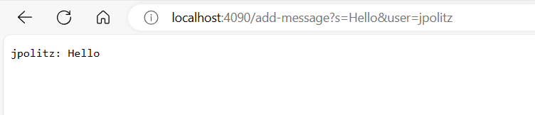
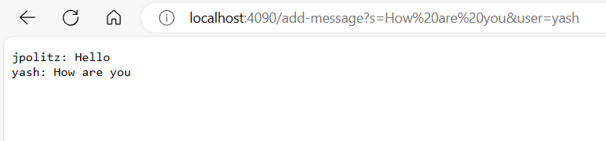
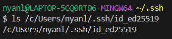
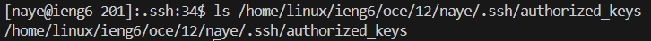
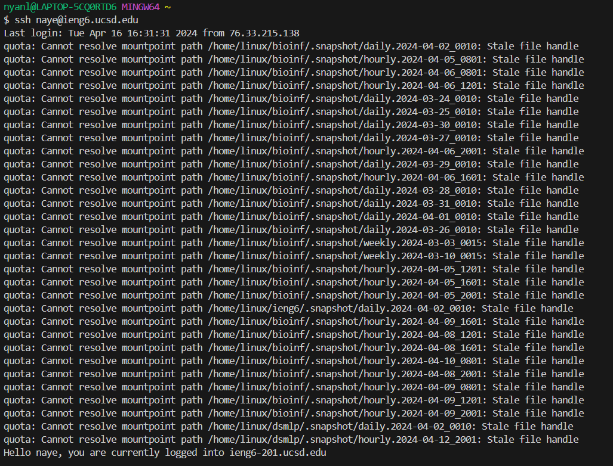
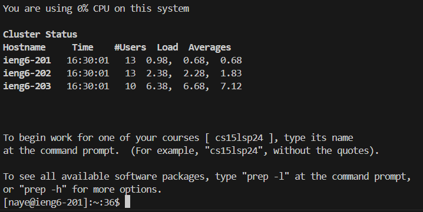

## Lab Report 2
### Part 1
This is the code block for ChatServer.java.
```
import java.io.BufferedWriter;
import java.io.FileWriter;
import java.io.IOException;
import java.io.PrintWriter;
import java.net.URI;
import java.nio.file.Files;
import java.nio.file.Paths;
import java.util.List;

class StringHandler implements URLHandler {
  List<String> lines;
  String path;
  StringHandler(String path) throws IOException {
    this.path = path;
    this.lines = Files.readAllLines(Paths.get(path));
  }
  public String handleRequest(URI url) throws IOException {
    String query = url.getQuery();
    if(url.getPath().equals("/add-message")) {
      if(query.startsWith("s=")) {
        String orig = query.substring(query.indexOf("="), query.length());
        if(orig.indexOf("&user=") != -1) {
          String user = orig.substring(orig.lastIndexOf("=") + 1);
          String message = orig.substring(1, orig.indexOf("&")); 
          orig = user + ": " + message; 
        } 
        else {
          return "/add-message requires a username parameter user\n";
        }
        this.lines.add(orig);
        this.log("/add-message?" + query);
        return String.format("New message from user: \n", orig.substring(orig.lastIndexOf("=") + 1));
      }
      else {
        return "/add-message requires a query parameter s\n";
      }
    }
    else {
      return String.join("\n", lines) + "\n";
    }
  }
  void log(String s) {
    try(FileWriter fw = new FileWriter("session.log", true);
        BufferedWriter bw = new BufferedWriter(fw);
        PrintWriter out = new PrintWriter(bw)) {
        out.println(s);
    } catch (IOException e) {
        //exception handling left as an exercise for the reader
    }
  }
}

class StringServer {
  public static void main(String[] args) throws IOException {
    if(args.length == 0){
      System.out.println("Missing both port number and file path! For the first argument (port number), try any number between 1024 to 49151. For the second argument (file path), give a path to a text file.");
      return;
    }
    if(args.length == 1){
      System.out.println("Missing port number or file path! For the first argument (port number), try any number between 1024 to 49151. For the second argument (file path), give a path to a text file.");
      return;
    }

    int port = Integer.parseInt(args[0]);

    Server.start(port, new StringHandler(args[1]));
  }
}
```

1. Methods called: `handleRequest`
2. Relevant arguments: `"/add-message?s=Hello&user=jpolitz"`

   Relevant fields: `lines` `query` `orig` `user` `message` 
3. Values changed:
   * `lines` includes a new value `"jpolitz: Hello"`
   * `query` value is changed to `"s=Hello&user=jpolitz"`
   * `orig` value is changed to `"jpolitz: Hello"`
   * `user` value is changed to `"jpolitz"`
   * `message` value is changed to `"Hello"`
  

1. Methods called: `handleRequest`
2. Relevant arguments: `"/add-message?s=How are you&user=yash"`

   Relevant fields: `lines` `query` `orig` `user` `message` 
3. Values changed:
   * `lines` includes a new value `"yash: How are you"`
   * `query` value is changed to `"s=How are you&user=yash"`
   * `orig` value is changed to `"yash: How are you"`
   * `user` value is changed to `"yash"`
   * `message` value is changed to `"How are you"`

### Part 2
1. 
2. 
3. 

### Part 3
From week 2, I've learned about creating my own web servers and seeing other people being able to edit it was rather novel. From week 3, I've also learned how to log into my CSE 15l account without the need to input my password everytime using ssh keys, which was very convenient and would save lots of time for future logins. Furthermore, trying to code my own chat server helped me remember old lessons from CSE 11 since it had been a year since I took the class. 
