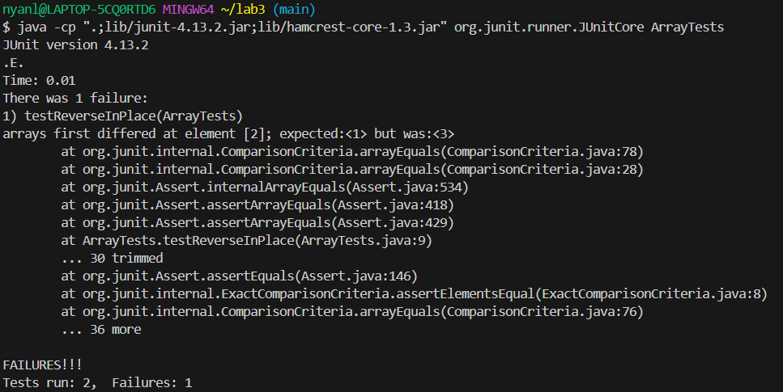
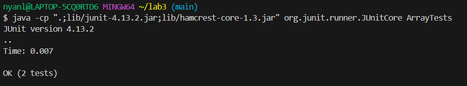

### Lab Report 3 
#### Part 1 - Bugs
We are going to choose the bug with the reverse methods in `ArrayExamples.java`, specifically the method `reverseInPlace`.

1. The failure inducing input. 
   ```
   public void testReverseInPlace() {
    int[] input1 = {1,2,3};
    ArrayExamples.reverseInPlace(input1);
    assertArrayEquals(new int[]{3,2,1}, input1);
	}
   ```
2. The input without failure
   ```
	public void testReverseInPlace() {
    int[] input1 = { };
    ArrayExamples.reverseInPlace(input1);
    assertArrayEquals(new int[]{ }, input1);
	}
   ```
3. 

   
4. Before and after code fixing the bug
   ```
   static void reverseInPlace(int[] arr) {
    for(int i = 0; i < arr.length; i += 1) {
      arr[i] = arr[arr.length - i - 1];
    }
   }
   ```
   ```
   static void reverseInPlace(int[] arr) {
    int[] newArray = new int[arr.length];
    for(int i = 0; i < arr.length; i += 1) {
      newArray[i] = arr[arr.length - i - 1];
    }
    for(int i = 0; i < arr.length; i++){
      arr[i] = newArray[i];
    }
   }
   ```   
5. The bug is fixed by adding a new variable called newArray. The reason this works is because if we just try to change the original variable directly by calling itself, it will not have the original values anymore and thus not know what numbers to actually reverse. (e.g if we started with 1,2,3, the method will swap 1 with 3 but then the original just becomes 3,2,3 and thus the method gets confused since it'll start referencing 3,2,3 instead of 1,2,3 as intended). 

#### Part 2 - Researching Commands
We are going to look at the applications of the `find` command. 
1. Using `-name`; looks through the entire directories that matches the string. Very useful if you do not know which file is in what directory. 
   ```
   $ find -name "chapter-1.txt"
   ./911report/chapter-1.txt
   ```
   ```
   $ find -name "chapter-13*.txt"
   ./911report/chapter-13.1.txt
   ./911report/chapter-13.2.txt
   ./911report/chapter-13.3.txt
   ./911report/chapter-13.4.txt
   ./911report/chapter-13.5.txt
   ```
   
2. Only looking for directories; This filters out files to only give you directories. It's helpful if you don't want to clog up the output with filenames. 
   ```
   $ find -type d
   .
   ./911report
   ./biomed
   ./government
   ./government/About_LSC
   ./government/Alcohol_Problems
   ./government/Env_Prot_Agen
   ./government/Gen_Account_Office
   ./government/Media
   ./government/Post_Rate_Comm
   ./plos
   ```
   ```
   $ find government -type d 
   government
   government/About_LSC
   government/Alcohol_Problems
   government/Env_Prot_Agen
   government/Gen_Account_Office
   government/Media
   government/Post_Rate_Comm
   ```
3. Using operators; The `or` statement means that the command will look for files/directories that fit either of the argument. 
   ```
   $ find -name "random.txt" -or -name "chapter-1.txt" -type f
   ./911report/chapter-1.txt
   ./random.txt
   ```
   ```
   $ find -name "random.txt" -or -name "doesnotexist.txt" -type f
   ./random.txt
   ```
4. Using `-not`; The `not` statement means that files/directories that match the argument will be excluded. Very useful if you want to filter out certain results.
   ```
   $ find -not -name "biomed" -type d
   .
   ./911report
   ./government
   ./government/About_LSC
   ./government/Alcohol_Problems
   ./government/Env_Prot_Agen
   ./government/Gen_Account_Office
   ./government/Media
   ./government/Post_Rate_Comm
   ./plos
   ```
   ```
   $ find 911report/chapter*.txt -not -name "chapter-1.txt"
   911report/chapter-10.txt
   911report/chapter-11.txt
   911report/chapter-12.txt
   911report/chapter-13.1.txt
   911report/chapter-13.2.txt
   911report/chapter-13.3.txt
   911report/chapter-13.4.txt
   911report/chapter-13.5.txt
   911report/chapter-2.txt
   911report/chapter-3.txt
   911report/chapter-5.txt
   911report/chapter-6.txt
   911report/chapter-7.txt
   911report/chapter-8.txt
   911report/chapter-9.txt
   ```

All command-line options from this website: https://math2001.github.io/article/bashs-find-command/
