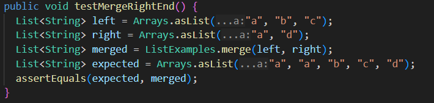
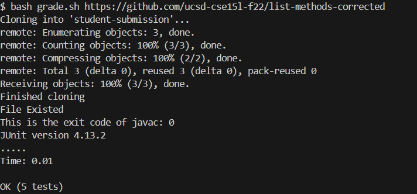
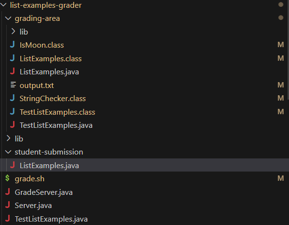
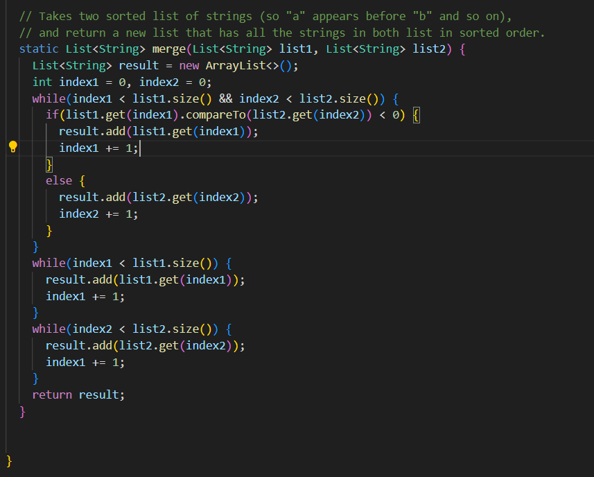
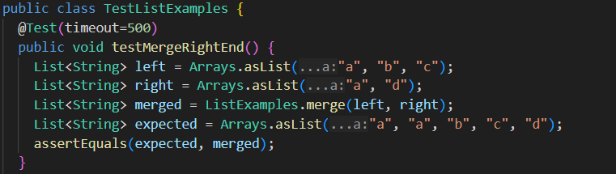

## CSE 15L Lab Report 5
### Part 1: Debugging Scenario
1. Student: Hi! I'm having some trouble with the merge method. I can't figure out why I'm getting this particular test wrong since all it's saying is that I got a timeout error. I think that maybe my code is just inefficient but I'm not too sure. I've attached a screenshot of my merge method and the test that is giving me an error.
   
2. TA: It's a good idea to check the while loops to make sure that you're not causing a infinite loop by accident.  
3. Student: Thank you! I realized that the last while loop had `index1` instead of `index2`. I've changed it and now my code runs perfectly fine.
   
5. All the information about the setup: 
    * The file and directory structure:

      
    * The contents of each file before fixing the bug:
      This is the relevant part for `StringChecker.java` and `TestListExamples.java`
       
    * The full command line (or lines) you ran to trigger the bug:
      `bash grade.sh https://github.com/ucsd-cse15l-f22/list-methods-lab3`
    * A description of what to edit to fix the bug:
      The student changed `index1` to `index2` in the last loop that was causing the infinite loop since the while condition never breaks and index2 
      never increases. 

### Part 2: Reflection
When I was first starting out with using JDB, it was all new to me and I didn't really know how to make use of it. But once I learned how to stop at certain lines and find information on relevant local variables, it really clicked with me and helped me with the debugging process even better than my usual process of trial and error. I also learned how to use vim and while it can be faster when you learn the right commands, I'm still more accustomed to manually editing things on VSC. 
