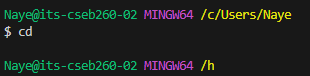
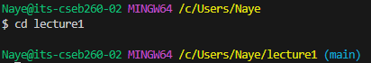
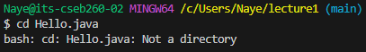
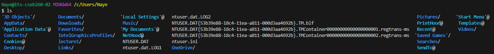
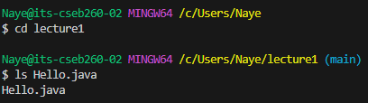
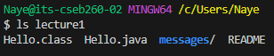
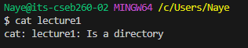
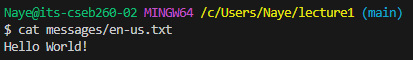

## Lab Report 1
### cd commands
1. cd without argument
	* 
	* Absolute Path: /c/users/Naye
	* Explanation: The reason that the directory changes to /h is because the home directory is what the CD command will default to if given no arguments  
	* Error: None, working as intended. 
2. cd with path to directory as argument
	* 
	* Absolute Path: /c/users/Naye
	* Explanation: The reason that the directory changes to /c/users/Naye/lecture1 is because we started from the absolute path and moved to the lecture1 directory when given lecture 1 as an argument.
 	* Error: None, working as intended.
3. cd with path to file as argument
	* 
	* Absolute Path: /c/users/Naye/lecture1
	* Explanation: Nothing happens because the file HelloWorld.java is not a directory and thus the CD command can't do anything with it. 
	* Error: Yes, the error occurs because the file path is not a directory.

### ls commands
4. ls without argument 
	* 
	* Absolute Path: /c/users/Naye/lecture1
	* Explanation: Nothing happens because the file HelloWorld.java is not a directory and thus the CD command can't do anything with it. 
	* Error: Yes, the error occurs because the file path is not a directory. 
5. ls with path to directory as argument
	* 
6. 
7. 
8. 
9. 
