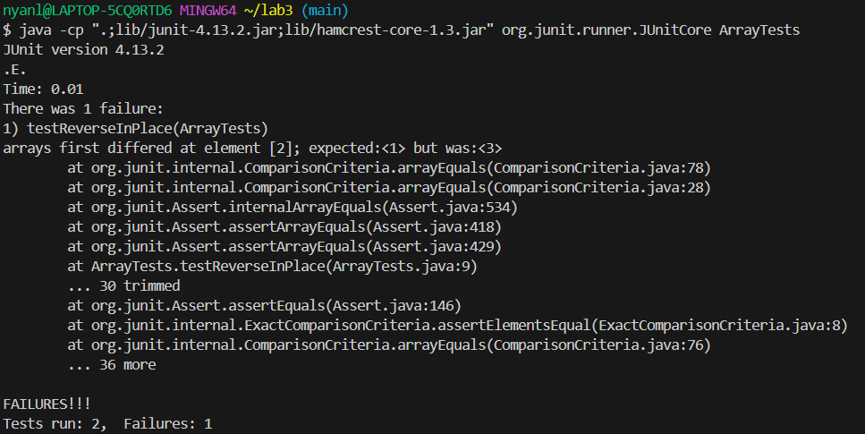
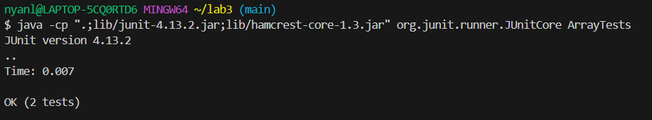

### Lab Report 3 
#### Part 1
We are going to choose the bug with the reverse methods in `ArrayExamples.java`, specifically the method `reverseInPlace`.

1. The failure inducing input. 
   ```
   public void testReverseInPlace() {
    int[] input1 = {1,2,3};
    ArrayExamples.reverseInPlace(input1);
    assertArrayEquals(new int[]{3,2,1}, input1);
	}
   ```
2. The input without failure
   ```
	public void testReverseInPlace() {
    int[] input1 = { };
    ArrayExamples.reverseInPlace(input1);
    assertArrayEquals(new int[]{ }, input1);
	}
   ```
   ```
   static void reverseInPlace(int[] arr) {
    for(int i = 0; i < arr.length; i += 1) {
      arr[i] = arr[arr.length - i - 1];
    }
   }
   ```
3. 

   
5. 
   ```
   static void reverseInPlace(int[] arr) {
    int[] newArray = new int[arr.length];
    for(int i = 0; i < arr.length; i += 1) {
      newArray[i] = arr[arr.length - i - 1];
    }
    for(int i = 0; i < arr.length; i++){
      arr[i] = newArray[i];
    }
  }
   ```   
