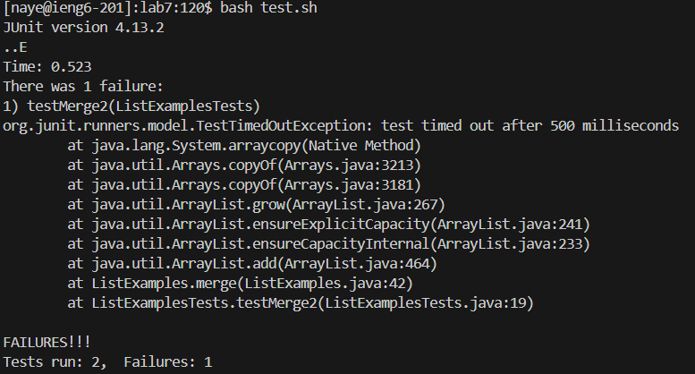

### Lab Report 4
We are going to reproduce the steps from the lab. 
1. **Setup** Delete any existing forks of the repository you have on your account. See this Github link on how to delete forks.
2. **Setup** Fork the repository
3. **The real deal** Start the timer!
4. Log into ieng6
   * 
   * `ssh <space> naye@ieng6.ucsd.edu`
5. Clone your fork of the repository from your Github account
   * 
   * `git <space> clone <space> https://github.com/Naye312/lab7.git`
6. Run the tests, demonstrating that they fail
   * 
   * `bash <space> test.sh`
7. Edit the code file to fix the failing test
   * 
   * `vim <space> ListExamplesTests.java`
     
     `/l2 <enter> nn <right> <esc> r1/l1 <enter> <right> r2 <esc> :wq`
8. Run the tests, demonstrating that they now succeed
   * 
   * `bash <space> test.sh`
9. Commit and push the resulting change to your Github account
   * 
   * `git <space> add <space> ListExamplesTests.java`
     
     `git <space> commit <space> -m <space> "Fixed second test"`
     
     `git <space> push`
